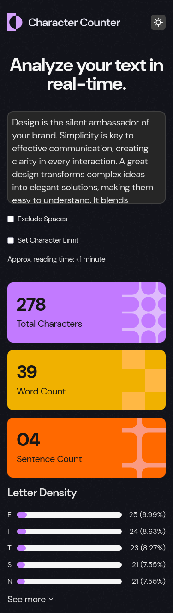
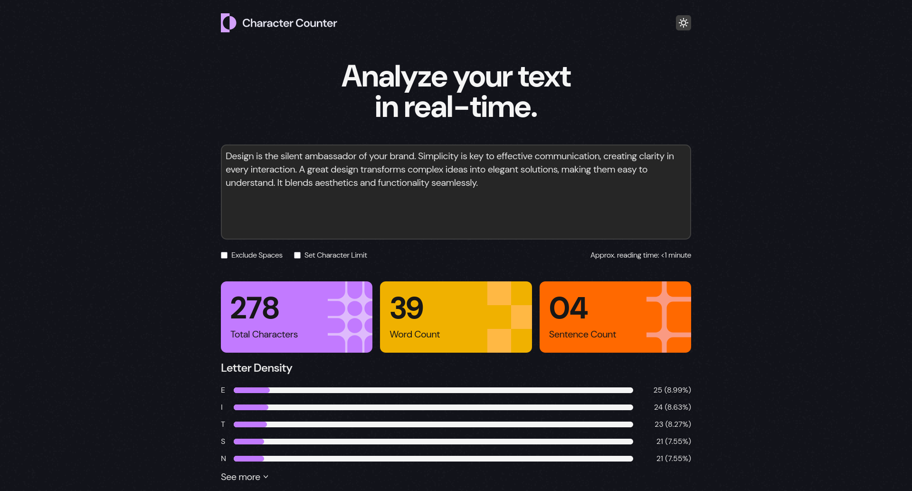

# Frontend Mentor - Character counter solution

This is a solution to the [Character counter challenge on Frontend Mentor](https://www.frontendmentor.io/challenges/character-counter-znSgeWs_i6). Frontend Mentor challenges help you improve your coding skills by building realistic projects.

## Table of contents

- [Overview](#overview)
  - [The challenge](#the-challenge)
  - [Screenshot](#screenshot)
  - [Links](#links)
- [My process](#my-process)
  - [Built with](#built-with)
  - [What I learned](#what-i-learned)
  - [Continued development](#continued-development)
  - [Useful resources](#useful-resources)
- [Author](#author)
- [Daily summaries](#daily-summaries)

## Overview

### The challenge

Users should be able to:

- Analyze the character, word, and sentence counts for their text
- Exclude/Include spaces in their character count
- ~~Set a character limit~~ (You can set a character limit but it won't do anything but display a warning - I will implement it in the future)
- Receive a warning message if their text exceeds their character limit
- See the approximate reading time of their text
- Analyze the letter density of their text
- Select their color theme
- View the optimal layout for the interface depending on their device's screen size
- See hover and focus states for all interactive elements on the page

### Screenshot

### Links

- Solution URL: [Add solution URL here](https://your-solution-url.com)
- Live Site URL: [Add live site URL here](https://your-live-site-url.com)

## My process

### Built with

- Semantic HTML5 markup
- CSS custom properties
- Flexbox
- CSS Grid
- Mobile-first workflow
- [React](https://reactjs.org/) - JS library
- [TypeScript](https://www.typescriptlang.org/) - JavaScript with types
- [TailwindCSS](https://tailwindcss.com/) - For styles
- [Vite](https://vite.dev/) - Build tool

### What I learned

### Continued development

### Useful resources

- [Adult Average Reading Speed](https://scholarwithin.com/average-reading-speed?#adult-average-reading-speed) - This helped me calculate the approximate reading time
- [How to pass HTML tags in props](https://stackoverflow.com/a/46484325/12159189) - This helped me pass a span (HTML) in the Stat component prop
- [Count sentences in string with JavaScript](https://stackoverflow.com/questions/35215348/count-sentences-in-string-with-javascript#comment101338973_35215653) - This helped me count the sentences accurately with regex
- [How do I detect dark mode using JavaScript?](https://stackoverflow.com/a/57795495/12159189) - This helped me implement the dark mode context
- [How to select <html> element using pure javascript?](https://stackoverflow.com/a/62375878/12159189) - This helped me retrieve the html tag in JS
- [Prevent useEffect listening to a state variable to fire on first render ](https://www.reddit.com/r/reactjs/comments/xd3ogf/comment/io96jss/?utm_source=share&utm_medium=web3x&utm_name=web3xcss&utm_term=1&utm_content=share_button) - This helped me understand that I don't need useEffect to react to something in my application

## Author

- Frontend Mentor - [@florianstancioiu](https://www.frontendmentor.io/profile/florianstancioiu)
- Threads - [@florianstancioiu01](https://www.threads.com/@florianstancioiu01)
- LinkedIn - [florianstancioiu](https://www.linkedin.com/in/florian-stancioiu-765661349/)
- freeCodeCamp - [florianstancioiu](https://www.freecodecamp.org/florianstancioiu)

## Daily summaries

| Date             | Time Spent | Summary                                                      |
| ---------------- | ---------- | ------------------------------------------------------------ |
| April 17th, 2026 | 4 hours    | I worked on the mobile version of the app                    |
| April 18th, 2026 | 5 hours    | I worked on the functionality and desktop version of the app |

_Total time spent working on the project:_ **9 hours**
